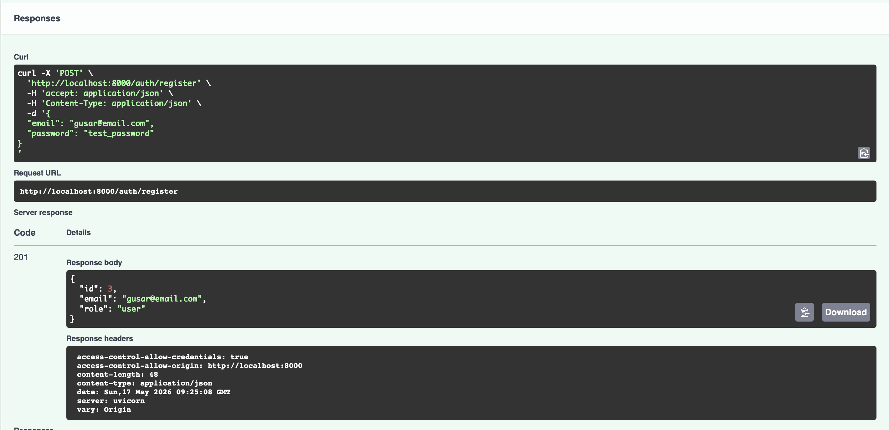
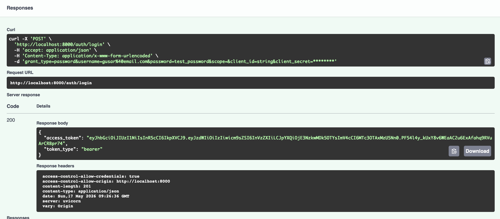
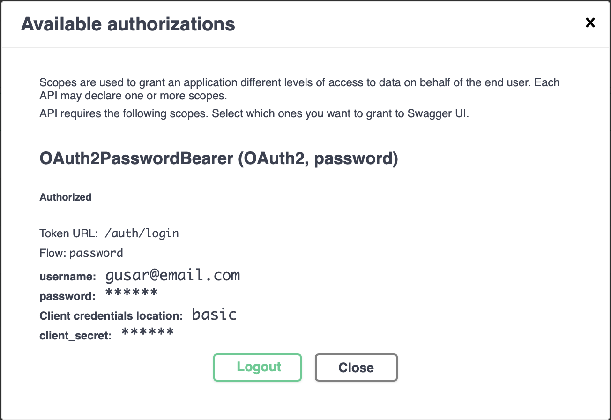
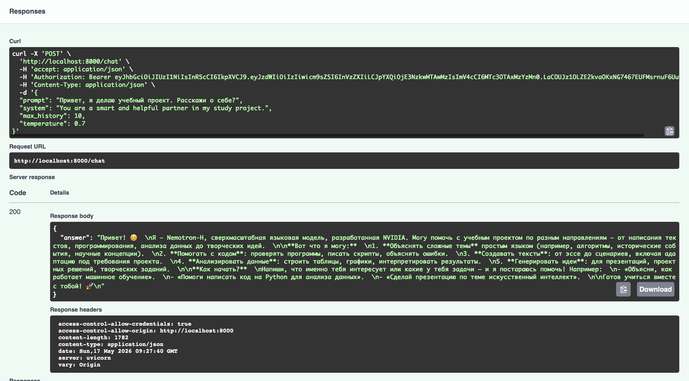
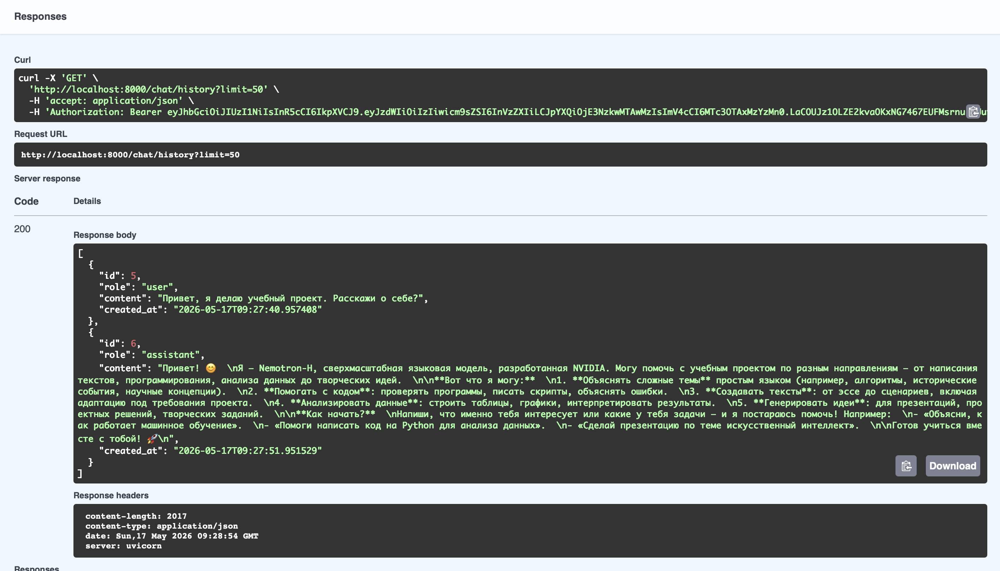
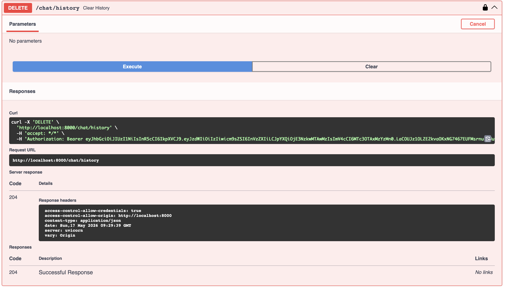
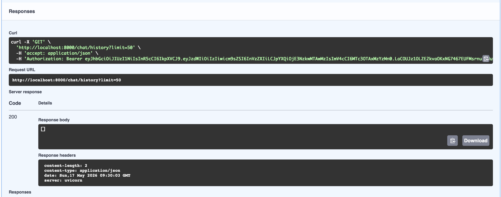

# Построение защищенного API для работы с LLM

## Цель работы

Цель проекта - реализовать серверное приложение на FastAPI, которое предоставляет
защищенный API для взаимодействия с LLM через OpenRouter.

В проекте реализованы:

- регистрация и вход пользователей;
- JWT-аутентификация;
- защищенные endpoints;
- хранение пользователей и истории чата в SQLite;
- обращение к OpenRouter API;
- разделение ответственности между слоями приложения.

## Архитектура

Приложение построено по схеме:

```text
API -> UseCases -> Repositories -> DB / Services
```

Основные директории:

```text
app/
├── main.py                 # сборка FastAPI-приложения
├── core/                   # конфигурация, безопасность, доменные ошибки
├── db/                     # SQLAlchemy base, session, ORM-модели
├── schemas/                # Pydantic-схемы
├── repositories/           # доступ к данным
├── services/               # внешний клиент OpenRouter
├── usecases/               # бизнес-логика
└── api/                    # HTTP-роуты и зависимости FastAPI
```

Роутеры не работают с базой данных напрямую и не содержат бизнес-логику.
Usecase-слой не зависит от FastAPI и выбрасывает доменные ошибки из
`app/core/errors.py`.

## Настройка окружения

Установка зависимостей:

```bash
uv sync
```

Создание `.env`:

```bash
cp .env.example .env
```

В `.env` необходимо указать ключ OpenRouter:

```env
OPENROUTER_API_KEY=your_openrouter_api_key
```

Основные переменные окружения:

```env
APP_NAME=llm-p
ENV=local
JWT_SECRET=change_me_super_secret
JWT_ALG=HS256
ACCESS_TOKEN_EXPIRE_MINUTES=60
SQLITE_PATH=./app.db
OPENROUTER_BASE_URL=https://openrouter.ai/api/v1
OPENROUTER_MODEL=openrouter/free
OPENROUTER_SITE_URL=https://example.com
OPENROUTER_APP_NAME=llm-fastapi-openrouter
```

Поля `APP_NAME`, `JWT_SECRET`, `SQLITE_PATH` и настройки OpenRouter являются
обязательными: если их нет в окружении, приложение не запустится.

## Запуск приложения

```bash
uv run uvicorn app.main:app --reload --host 0.0.0.0 --port 8000
```

Swagger UI:

```text
http://localhost:8000/docs
```

Проверка состояния сервера:

```text
GET http://localhost:8000/health
```

Таблицы базы данных создаются при старте приложения через FastAPI `lifespan`.
Это современный вариант startup-логики, рекомендованный в документации FastAPI:
https://fastapi.tiangolo.com/advanced/events/

## Реализованные endpoints

- `GET /health` - проверка состояния сервера;
- `POST /auth/register` - регистрация пользователя;
- `POST /auth/login` - вход и получение JWT;
- `GET /auth/me` - профиль текущего пользователя;
- `POST /chat` - запрос к LLM;
- `GET /chat/history` - история сообщений;
- `DELETE /chat/history` - очистка истории.

## Формат ошибок

Для ошибок приложения используется единый формат ответа. Usecase-слой выбрасывает
доменные ошибки из `app/core/errors.py`, а HTTP-слой преобразует их в ответ
FastAPI через helper `app/api/errors.py`.

Пример:

```json
{
  "detail": {
    "code": "UNAUTHORIZED",
    "message": "Invalid email or password"
  }
}
```

## Модель OpenRouter

В проекте используется:

```env
OPENROUTER_MODEL=openrouter/free
```

Модель из задания `stepfun/step-3.5-flash:free` на момент проверки не была
доступна бесплатно: OpenRouter возвращал ошибку
`No endpoints found for stepfun/step-3.5-flash:free`.

Поэтому был выбран официальный free-router OpenRouter, который автоматически
направляет запрос на доступную бесплатную модель.

Документация OpenRouter:
https://openrouter.ai/docs/guides/routing/routers/free-router

## Демонстрация работы

### 1. Регистрация пользователя

В Swagger UI выполняется запрос `POST /auth/register`.



### 2. Вход пользователя

В `POST /auth/login` email вводится в поле `username`, пароль - в поле
`password`. В ответе возвращается JWT access token.



### 3. Авторизация в Swagger

Полученный JWT вставляется через кнопку `Authorize` в Swagger UI.



### 4. Запрос к LLM

После авторизации выполняется `POST /chat`. Сервер передает запрос в OpenRouter,
получает ответ модели и сохраняет запрос и ответ в историю.



### 5. Просмотр истории

Endpoint `GET /chat/history` возвращает сохраненные сообщения текущего
пользователя.



### 6. Очистка истории

Endpoint `DELETE /chat/history` удаляет историю текущего пользователя.



После удаления история становится пустой.



## Проверка качества кода

Линтер `ruff` вынесен в dev-группу зависимостей, потому что он нужен только
для разработки и проверки качества кода, а не для запуска приложения.

```bash
uv run ruff check
```

Ожидаемый результат:

```text
All checks passed!
```
